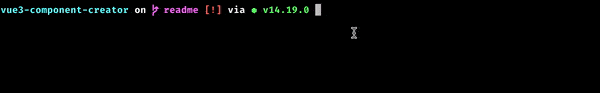

# vue3-component-creator

CLI util for easy generation of a Vue3 component with integrated test structure.

A Vue3 component with TypeScript support and a Jest unit test can be created with just one command. The unit test contains a mount of the created component to easily start writing tests. Moreover, a failing test is included to raise your awareness. The component uses the new Vue Composition API. 

## Installation
```
npm i -g vue3-component-creator
```

## Usage

### Create new component
```
vue3-cc component new
```
Then follow the instructions on the CLI. See the following example:



## Contribute
If you want to fix/improve the package you're welcome to create a PR. Please note that this project with [Contributing Guidelines](https://github.com/jtpfa/vue3-component-creator/blob/main/CONTRIBUTING.md).
